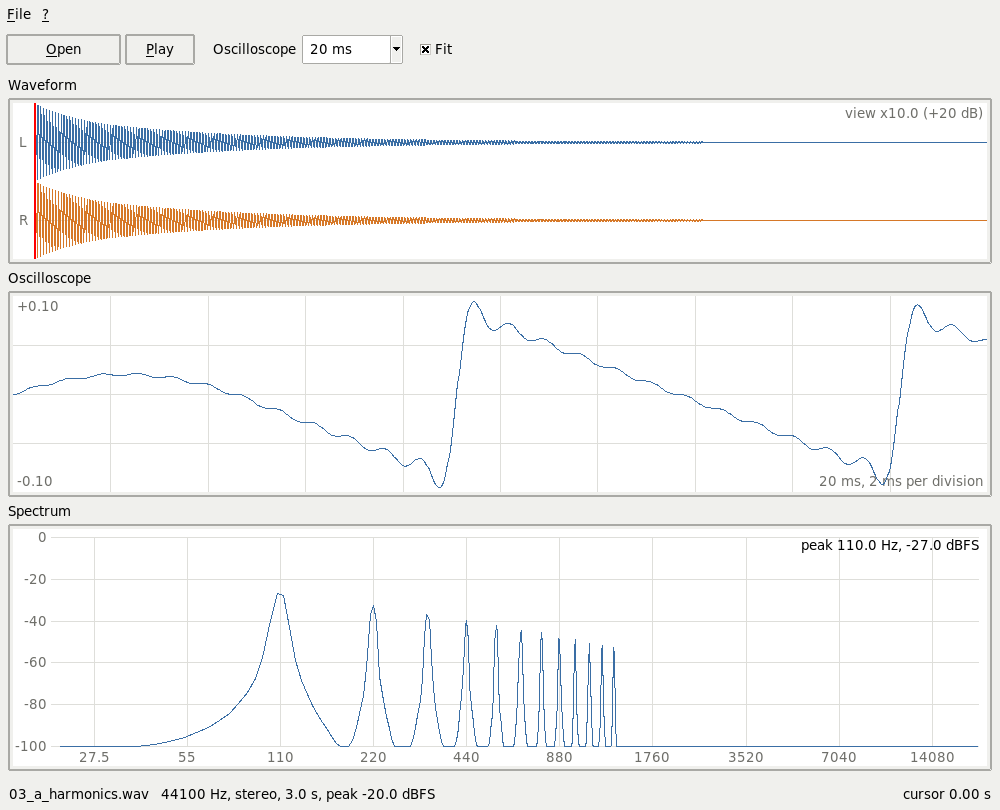
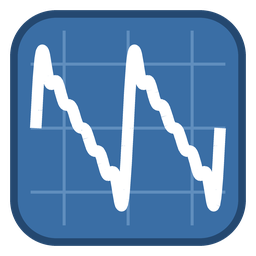

# auditus

*auditus, -us* (Latin): hearing, the act of listening.

**Hear it, then see it: a hands-on course in sound for musicians, with its own analyser.**



A hands-on course in acoustics and audio for musicians, built on a real home
setup: a Steinberg UR22mkII interface, a condenser microphone, two desktop
speakers and a guitar. Each lesson pairs a little theory with a listening test,
using sounds generated by the computer or recorded.

First we learn to **listen**, then to **record**.

## Lessons

| # | Title | Status |
| --- | --- | --- |
| 1 | Sound and hearing | done |
| 2 | Optimising the listening setup | to do |
| 3 | The numbers of sound: dB, dBFS, sample rate, bit depth | to do |
| 4 | Critical listening | to do |

A second part on recording will follow: microphones, miking an acoustic
guitar, voice and guitar, basic editing, exporting.

Each lesson has a folder in `lessons/` with a script that generates its test
sounds and a printable handout:

```
cd lessons/01_sound_and_hearing
python3 make_sounds.py
python3 handout.py
```

## Listening

We are on Linux: files are played with `aplay` (package `alsa-utils`), from
the terminal, with no heavy player.

```
aplay sounds/01_a_110hz.wav                # through PulseAudio: the normal way
aplay -l                                   # lists the sound cards and their numbers
```

All the sounds of a lesson, one after another:

```
for f in sounds/*.wav; do echo "$f"; aplay -q "$f"; done
```

Without `-D` the sound goes through PulseAudio, which sends it to the default
output and mixes it with whatever is already playing (the browser, Spotify).
Ctrl+C stops playback.

`aplay -D plughw:1,0 file.wav` bypasses PulseAudio and talks to card 1
directly: it works only if nothing else is using it, otherwise it answers
`Device or resource busy`.

## Oscillum



`oscillum/` is the course's sound analyser: open a WAV, listen to it and
see it at the same time, in three synchronised views.

| View | What it shows |
| --- | --- |
| Waveform | the whole file, left and right channel, with the cursor |
| Oscilloscope | 5 to 100 ms around the cursor: the wave itself |
| Spectrum | FFT at the cursor on a logarithmic axis, in dBFS, with the main peak |

```
python3 oscillum/oscillum.py lessons/01_sound_and_hearing/sounds/03_a_harmonics.wav
python3 oscillum/oscillum.py --trace file.wav    # and print what it does on the terminal
```

It speaks English and Italian: the system's language by default, or the one
asked for with `--lang=en` or `--lang=it`. The sentences live in
`oscillum/i18n.py`, one row per sentence and one column per language.

Space bar to play and stop, click on the waveform to move; when playback
ends the cursor goes back to where it started, like a tape recorder. "Fit"
zooms waveform and oscilloscope to the file's peak; the spectrum stays in
absolute dBFS. Only Tkinter and numpy; audio goes through `aplay`.

It is built the way the author's other Tkinter programs are
([Tkinterlite](https://github.com/1966bc/Tkinterlite)): an `App` holding a
`Main` frame, an `Engine` that owns its parts by composition (`tools`, `wav`,
`player`, `log`), one class per module, each chart a `tk.Canvas` subclass,
`.format()` strings and one exit per function.

### Tests

```
cd oscillum
python3 -m unittest discover -s tests -v
```

The standard library's `unittest`, one file per module: translations, WAV
reading at every sample width, the log, the player's clock and the
arithmetic of the spectrum. The spectrum tests need a display and are
skipped without one.

## Tools

In `tools/`, to analyse your own recordings:

| Script | What it does |
| --- | --- |
| `levels.py` | duration, peak and RMS in dBFS, clipped samples |
| `accents.py` | tempo, swing and accent per beat of a rhythm part |
| `chords.py` | chords per half bar, chosen among the given candidates |
| `midinfo.py` | tracks, instruments, tempo and metre of a MIDI file |

```
cd tools
python3 levels.py recording.wav
python3 accents.py verse.wav --channel 2
python3 chords.py song.wav --chords A,D7,E7,F#m,F
```

## Manual

`manual/` holds a short guide to the Steinberg UR22mkII on Linux (Debian,
PulseAudio, ALSA): panel, connections, gain, monitoring, everyday listening,
`arecord`/`aplay` commands, common problems, a safe order for +48V. The PDF is
regenerated with:

```
python3 manual/ur22mkii_manual.py
```

## Requirements

Python 3, numpy and reportlab (Debian packages `python3-numpy` and
`python3-reportlab`), Tkinter (`python3-tk`). For listening, `aplay`
(`alsa-utils`).

## Licence

MIT, see `LICENSE`.
